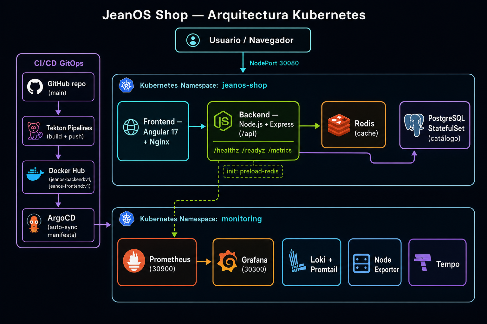

# JeanOS Shop

Tienda de **hardware y componentes de PC** desplegada en Kubernetes, con catálogo por clases, especificaciones técnicas y un **comparador de 3 productos** de la misma clase (GPU, RAM, SSD, motherboard, PSU).

El proyecto cubre el ciclo completo: aplicación (frontend + backend), datos (PostgreSQL + Redis), despliegue en Kubernetes, observabilidad (Prometheus, Grafana, Loki, Tempo) y CI/CD GitOps (Tekton + ArgoCD).

## Arquitectura



| Capa | Tecnología | Detalle |
|------|------------|---------|
| Frontend | Angular 17 + Nginx | SPA servida en NodePort `30080` |
| Backend | Node.js + Express | API REST `/api/*`, `prom-client` en `/metrics` |
| Caché | Redis | Precarga vía init container `preload-redis` |
| Base de datos | PostgreSQL (StatefulSet) | Catálogo: clases, productos, especificaciones |
| Observabilidad | Prometheus, Grafana, Loki, Promtail, Tempo, Node Exporter | Namespace `monitoring` |
| CI | Tekton Pipelines | `git-clone` → build → push a Docker Hub |
| CD | ArgoCD | Auto-sync de manifests desde `main` (GitOps) |

## Componentes de la aplicación

### Backend (`app/backend`)

API REST con métricas Prometheus y caché Redis con fallback a PostgreSQL.

| Endpoint | Descripción |
|----------|-------------|
| `GET /api/classes` | Clases de producto (gpu, ram, ssd, motherboard, psu) |
| `GET /api/products` | Catálogo completo; filtro `?class=gpu` |
| `GET /api/products/:id` | Detalle con especificaciones |
| `POST /api/compare` | Compara **exactamente 3 productos** de la misma clase |
| `GET /healthz` | Liveness |
| `GET /readyz` | Readiness (exige PostgreSQL + Redis) |
| `GET /metrics` | Métricas Prometheus |

Métricas expuestas: `jeanos_http_requests_total`, `jeanos_http_request_duration_seconds`, `jeanos_cache_hits_total`, `jeanos_cache_misses_total`, `jeanos_comparator_requests_total`, `jeanos_comparator_duration_seconds`.

### Frontend (`app/frontend`)

Angular 17 standalone con dos vistas:

- **Catálogo:** filtro por clase, selección de hasta 3 productos de la misma clase.
- **Comparador:** tabla de especificaciones de 3 columnas, producto más barato y rango de precio.

### Datos

- **PostgreSQL:** esquema en `ansible-k8s/seed-productos.sql` (idempotente) — 5 clases, 25 productos, 25 definiciones de spec, 125 valores.
- **Redis:** claves `classes:all`, `products:all`, `products:class:{slug}`, `product:{id}:details`, `compare:{ids ordenados}`.

## Estructura del repositorio

```
app/
├── backend/          # Node.js + Express (API, métricas, preload Redis)
└── frontend/         # Angular 17 + Nginx
ansible-k8s/
├── manifests/
│   ├── namespace/    # namespace jeanos-shop
│   ├── postgresql/   # StatefulSet + Service + Secret
│   ├── redis/        # Deployment + Service + ConfigMap
│   ├── backend/      # Deployment + Service
│   ├── frontend/     # Deployment + Service (NodePort 30080)
│   ├── monitoring/   # Prometheus, Grafana, Loki, Promtail, Tempo, Node Exporter
│   └── semana-4/     # Tekton (tasks, pipeline) + ArgoCD (Application)
├── seed-productos.sql       # Esquema y datos del catálogo
├── deploy-jeanos.sh         # Despliegue ordenado de la tienda
├── deploy-semana4.sh        # Tekton + ArgoCD
└── redeploy-jeanos.sh       # Redeploy (seed, rollout, smoke tests)
scripts/
└── build-push-x86-aliothosa.sh   # Build/push imágenes linux/amd64
docs/                # Guías por semana, queries Grafana, evidencias
```

## Despliegue

### 1. Aplicación en Kubernetes

```bash
./ansible-k8s/deploy-jeanos.sh --yes
```

Despliega en orden: namespace → PostgreSQL → seed SQL → Redis → backend → frontend.
La tienda queda en `http://<IP-NODO>:30080`.

### 2. Observabilidad (Semana 3)

Prometheus, Grafana, Loki, Promtail, Tempo y el dashboard provisionado *jeanOS — Hardware del cluster*. Ver `docs/SEMANA-3-REPLICAR.md`.

- Grafana: `http://<IP-NODO>:30300` (`admin` / `jeanos2026`)
- Prometheus: `http://<IP-NODO>:30900`
- Queries listas para usar: `docs/GRAFANA-QUERIES-JEANOS.md`

### 3. CI/CD GitOps (Semana 4)

```bash
cp ansible-k8s/lab.env.example ansible-k8s/lab.env   # editar REGISTRY, DOCKER_TOKEN, rama
./ansible-k8s/deploy-semana4.sh --yes
```

- **Tekton** construye `app/backend` y `app/frontend` y publica en Docker Hub.
- **ArgoCD** (`jeanos-shop-gitops`) sincroniza `ansible-k8s/manifests/{backend,frontend}` desde `main`.
- Detalle y troubleshooting: `docs/SEMANA-4-REPLICAR.md`.

### Redeploy / build manual

```bash
# Build y push de imágenes (linux/amd64)
export REGISTRY=docker.io/TU_USUARIO TAG=v1
./scripts/build-push-x86-aliothosa.sh

# Redeploy: seed + rollout + smoke tests (configurable en redeploy.env)
cp ansible-k8s/redeploy.env.example ansible-k8s/redeploy.env
./ansible-k8s/redeploy-jeanos.sh
```

## Verificación rápida

```bash
NODE_IP=<IP-NODO>

curl -s "http://${NODE_IP}:30080/api/classes"
curl -s "http://${NODE_IP}:30080/api/products?class=gpu"
curl -s -X POST "http://${NODE_IP}:30080/api/compare" \
  -H "Content-Type: application/json" \
  -d '{"ids":[1,2,3]}'
```

## Documentación

| Documento | Contenido |
|-----------|-----------|
| `docs/SEMANA-3-REPLICAR.md` | Despliegue de monitoreo |
| `docs/SEMANA-4-REPLICAR.md` | Tekton + ArgoCD (CI/CD) |
| `docs/GRAFANA-QUERIES-JEANOS.md` | Queries Prometheus/Loki y dashboards |
| `docs/GUIA-X86-ALIOTHOSA.md` | Cluster x86_64 (imágenes `aliothosa/jeanos-*`) |
| `docs/GUIA-EQUIPO-LAB.md` | Cluster ARM64 del equipo |
| `docs/evidencias/README.md` | Checklist y recolección de evidencias |

## Ramas

| Rama | Uso |
|------|-----|
| `main` | Rama principal; Tekton y ArgoCD apuntan aquí |
| `lab/x86-aliothosa` | Cluster x86_64 — imágenes `aliothosa/jeanos-*:v1` |
| `lab/equipo` | Cluster ARM64 del equipo |

## Stack técnico

Node.js 22 · Express 5 · PostgreSQL · Redis · Angular 17 · Nginx · Kubernetes · NFS StorageClass · Prometheus · Grafana · Loki · Tempo · Tekton · ArgoCD · Docker/Podman
